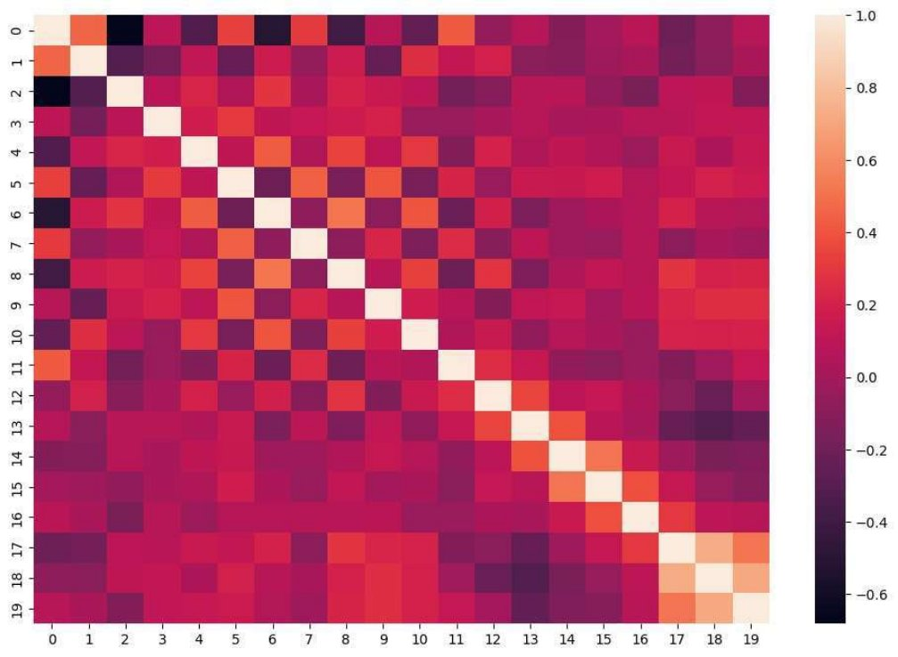
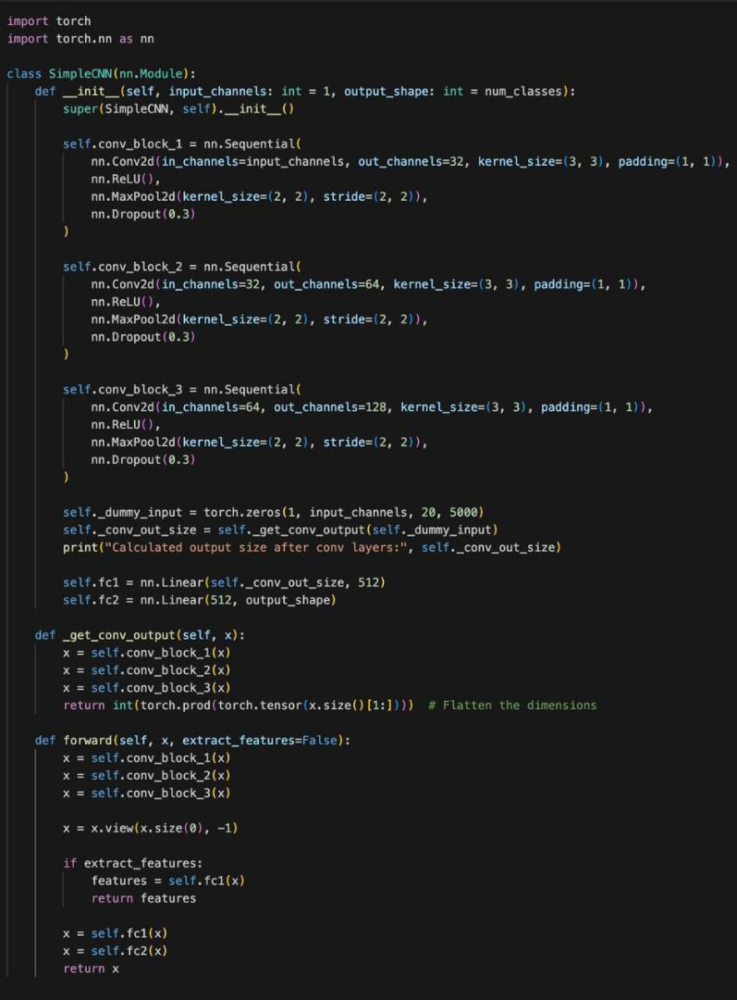

` `****

**

**INTRODUCTION![ref1]![ref2]**

- This project focuses on analyzing a dataset of 115 songs using **Mel- Frequency Cepstral Coefficients (MFCCs)** to group the songs by their genres and artists
- We aim to identify and classify specific songs, such as the **Indian National Anthem**, songs by iconic artists like **Asha Bhosle**, **Kishore Kumar**, and **Michael Jackson** and **Marathi Bhavgeet** and **Lavni**
- The analysis involves applying **machine learning techniques** to classify songs based on their vocal and instrumental characteristics

WHAT ARE **MFCC COEFFICIENTS?![ref1]![ref2]**

MFCCs are **Mel-Frequency Cepstral Coefficients**. 

**Mel-frequency cepstral coefficients** (MFCCs) are a set of features that represent the spectral envelope of a sound signal. They are commonly used in speech recognition systems to analyze and model human voice characteristics

MFCCs tell us about the following:

1. **Frequency Content**
2. **Perceived Pitch and Timbre**
2. **Speech Patterns**

How are they **calculated**?

**Discrete Fourier Transform**

**Discrete Cosine Transform**

**FILE SEGMENTATION![ref2]**

**Step 1** : **Framing** and **Windowing** involves **segmenting** the signal into short frames and applying a window function to reduce signal **edge effects**.

**FILE PROCESSING![ref2]**

**Step 2** : Finding the **Fast Fourier Transform**, converting each frame to the **frequency** domain 

**Step 3** :** Applies **triangular filters** spaced according to the **Mel scale**  to approximate human hearing 

**Step 4** : The data is then **compressed** by taking the **log** of the power spectrum and applying **DCT**, resulting in MFCCs

**LimLiItMatIiTonAsToIOf MNFSCOCFCMoeFfCficCients![ref2]**

- Loss of **Temporal Information**
- Sensitivity to **Noise**
- Inflexibility with **Pitch Variations**
- Limited **Effectiveness** for Music and Non-Speech Sounds

  **The Overall Approach...![ref3]![ref4]**

  A brief overview of the thought process and steps involved behind solving the problems

**Step I![ref3]![ref4]**

Downloaded the **MFCC zip files** and performed **EDA** on them; Decided on a **CNN model**

**Step II**

**Downloaded** audio files from YouTube

Converted the audio files into **CSV files** containing the respective MFCC coefficients **Preprocessed** the data, removed outliers

**Step III![ref3]![ref4]**

Split the downloaded data into **training** and **test** data

**Trained** the CNN model based on the training data 

**Step IV**

Calculated train and test data **performance metrics** for the model

Fed the given data into the model and obtained the **grouped data**

**EXPLORATORY DATA ANALYSIS![ref2]**

**HEAT MAP CORRELATION MATRIX** 

**PRINCIPAL** 

**COMPONENT** 

**SCREE PLOT  ANALYSIS** 

||
**TIME SERIES ANALYSIS**

Plots of each **component vs time**

Uses a time scale where **1 second** approximately equals **86 units** on the x-axis

The **first component** remains consistently **negative**, the **second** stays **positive**, and the remaining components fluctuate near **zero**
|
**Each of the 20 components of the MFCC file**

|
| :- | :-: | - |
||
**HEAT MAP**

The adjoining heatmap is of the **normalised data** 

It shows that the **lower coefficients** capture relatively **more variation**, as can be seen by the distinct stripes
|
**Heat map for one of the MFCC files**

|
||
**CORRELATION MATRIX**

Apart from the diagonal, the values in the correlation matrix is primarily between **-0.4** and **0.4**

This tells us that there is very **less correlation** between the 20 features of the MFCC data 
|**20 x 20 correlation matrix for the coefficients**|
||
**SCREE PLOT**

The scree plot takes a **sudden turn** at principal component **6** This shows that considering around **5-6 principal components** is enough because after that the

variance starts falling a lot
|
**Scree Plot for cumulative variance vs**

**number of principal components**
|
||
**PCA ANALYSIS**

The points around (25000,3000) and (−15000,5000) are particularly distant from the main cluster This might mean these features have a **significantly different variance** **or distribution** compared to the rest

These outliers are the **first two components** of the given MFCC data
|
**PC1 vs PC2 for each component**

|
||
**SPECTOGRAM**

We created a spectrogram to show the **frequency content** of audio signals over time, making it easier to see patterns and differences in the sounds

` `This helps us identify **key features** for each song or genre
|
**Spectogram of one of the audio files**

|
||
**DELTA COEFFICIENTS**

Since most of the heatmap is very light, it suggests that the delta coefficients are **close to zero** for much of the audio, meaning there are **few strong transitions** in MFCC values over time.
|
**MFCC delta coefficients**

|
||
**CHROMAGRAM**

Chroma features capture the **harmonic content** of a sound

by mapping the audio

spectrum into **12 distinct pitch classes** in this order :

`           `C, C#, D, D#, E, F, F#, G,                 G#, A, A#, and B.
|
**Chromagram of one of the songs** 

|

**Our apprach for Unsupervised ![ref5]learning**

For each attempt, we selected our features, applied the **K-means clustering** algorithm, and evaluated the resulting clusters using the **Silhouette score**

Then, we used **PCA** to reduce the data to the top 3 principal components for visualization in a **scatter plot**

**OUR FAILED ATTEMPTS USING UNSUPERVISED LEARNING ARE ON THE NEXT 4 SLIDES**

**Failed Attempt 4****

- We calculated the **mean**, **variance**, **skewness**, **kurtosis**, **delta mean**, **delta variance**, **delta square mean**, and **delta square variance** as input features for each column.
- Silhouette Score: **0.2987**
- Why it doesn’t work : The extracted statistical features lack the ability to capture the underlying structure of the data, leading to poor clustering results with k-means.![ref6]
- Here we used data of only the **first 5 second** of each song, and again calculated the same 8 parameters to check if the starting beat could help classify the songs
- Silhouette Score: **0.3001**
- Why it doesn’t work : Early sections of songs can often be similar or less varied, especially across genres with overlapping styles, making it harder for the model to capture unique patterns for accurate classification.![ref6]
- We **shrunk** all the songs to **60 seconds** by removing datapoints at fixed intervals expecting clear clusters for National Anthem as the data given for the National anthem was of varied length but the National Anthem is supposed to be 52 sec.
- Silhouette Score : **0.1184**
- Why it doesn’t work : Reducing all songs to 60 seconds may have removed meaningful temporal features, causing poor clustering![ref6]
- Here we reduced the rows (time series data) which ranged from 5,000-20,000 of them to 20 by calculating the **PCA** and using the top 20 features
- Silhouette Score : **0.2008**
- Why this doens’t work : Reducing the time series data to 20 PCA features likely discarded essential temporal patterns, leading to weak clustering performance![ref6]

**Why we chose CNNs... ![ref5]**Despite trying various

unsupervised methods, the

**silhouette score** stayed **below**

**0.3**

As a result, we switched to using

a **CNN** to automatically learn

and extract meaningful

features, reducing the data to

**512 components**

We then performed clustering

on these learned

representations

**GENERATING THE DATASET ![ref7]**

- Used an **API** to retrieve around **80** songs per artist from **Spotify** and downloaded them from YouTube; for categories like Bhavgeet, downloaded about 80 songs directly from their **YouTube** playlists 
- Converted each downloaded song into **MFCC** coefficients using the given conversion code for further processing 

**PREPROCESSING THE DATA![ref7]**

- Used the Exponential Moving Average (**EMA**) method to **smoothen** the generated data, reducing **noise** and emphasising **trends**
- Removed outliers from the data to improve **accuracy** and prevent anomalies from affecting the results

**CREATING THE DATASET ![ref7]**

- Preprocessed the data and reduced each sample to a **20x5000 tensor** using **interpolation** to standardize input size 
- Imported CSV files and applied an **80-20 train-test split** for model evaluation 
- Implemented a **custom Dataset** and **DataLoader class** for efficient batch processing and seamless data feeding into the model 

**CREATING THE MODEL ![ref7]**

- We chose a **CNN model** due to the **high-dimensional** nature of each input (**5000x20**), allowing it to effectively capture spatial and temporal patterns through hierarchical feature extraction 

**CNN EXTRACTING FEATURES ![ref7]**

- The CNN extracts **relevant features** from the input data, progressively capturing more complex patterns through each **convolutional block** 
- Before the **final layer**, the network reduces these features to a **512-dimensional vector**, which we use for cluster analysis and data visualization 

**TRAINING THE MODEL ![ref7]**

- Ran the model for **19 epochs**, monitoring the loss and accuracy to ensure convergence 
- Used an **Adam optimizer** and a **Cross entropy loss rate** scheduler to fine-tune the training process. 
- Logged metrics such as loss, accuracy, and validation performance for each epoch 

**ACCURACY ON THE DATASETS![ref7]**

- This **does not reflect** the **accuracy** we ![ref8]![ref8]![ref8]would get on the **dataset** given but gives a good general idea because the audio files are very **similar** 
- After running **19 epochs**, the following metrics were obtained 

**t-SNE OF THE TRAIN DATA ![ref7]**

- Used **t-SNE** on training data to visualize high- dimensional patterns in 3D, limited to the **top 3 principal components** 
- Clusters appear **unclear**; using more components could **improve separation** and reveal **feature distinctions** 

**t-SNE OF THE TEST DATA ![ref7]**

- Similarly, **t-SNE** was applied to the testing data to **visualize** it in 3D using its top **3 principal components** 
- The clusters appear **indistinct**, indicating that incorporating more components could provide separation 

**ELBOW PLOT ![ref7]**

- We used an **elbow plot** to find the **optimal** number of principal components for t-SNE, which **stabilizes** at the 4th or 5th component 
- This suggests that using **4 or 5 components** would improve **cluster clarity** by better capturing **data variance**

**EVALUATING GIVEN DATA ![ref7]**

- Imported the provided **MFCC files**, processed the data, and **reshaped** it to match the model's expected input dimensions 
- Passed the processed data through the model to obtain **category probabilities** 
- Logged the probabilities for each category and identified the **predicted category** based on the **highest probability** value from the **sigmoid output** 

` ` 

**RESULT ANALYSIS ![ref7]**

- We observe high certainty for certain songs, likely because they **coincidentally** appear in the **training dataset** and represent popular hits by each artist 
- For example, many **Michael Jackson** songs are **confidently classified** as his due to their distinct style
- The National Anthem shows **low certainty** since it's unlikely that the exact version in our dataset appears in the training data

**SONG DISTRIBUTION ACROSS GROUPS**

**AB** - Asha Bhosle **INA** - Indian National Anthem **MJ** - Michael Jackson **MB** - Marathi Bhavgeet

**KK** - Kishore Kumar **ML** - Marathi Lavani

**t-SNE OF THE SONG PREDICTIONS![ref7]**

- The clusters appear **indistinct** due to the use of only 3 principal components, which **restricts** the data's **representational capacity**
- Increasing the dimensionality to 4 or 5 components could likely **enhance cluster separation**, making the groupings more distinct and well-defined

**3 AUDIO FILE NUMBERS CORRESPONDING TO EACH SINGER![ref7]**

**National Anthem**

27 35 87

**Asha Bhosale**

15 39

77

**Kishore Kumar**

59 83 84

**Michael Jackson**

3

8 20

**RESULTS![ref7]**

**How many problems have been correctly solved?**

Solved Problems 1, 2, 3

- **Problem 1** : Classified the 116 songs into the 6 groups as shown in [slide 36](#_page35_x0.00_y-7.00)
- **Problem 2** : National Anthem file numbers : 27, 35, 87
- **Problem 3** : Asha Bhosle file numbers          : 15, 39, 77

`                             `Kishore Kumar file numbers     : 59, 83, 84

`                             `Michael Jackson file numbers : 3, 8, 20

`     `This is show in [slide 34](#_page40_x0.00_y-7.00)

**Has there been any creative thinking and innovation while solving the problems?**

- **Unique Dataset Creation** : Collected audio data by downloading songs from YouTube, creating a diverse dataset with different genres and sound qualities
- **CNN for Audio Classification** : Applied CNNs, which are usually used for images, to classify audio data, showing a new way to use deep learning for this task
- **3D Classification Plots** : Used 3D plots to visualize data where 2D plots wouldn’t provide enough information

**Quality of Feature Engineering / Feature Creation in terms of relevance to the problem**

- **Automatic Feature Learning** : The convolutional layers automatically learn relevant features from raw data, reducing the need for manual feature extraction
- **Relevance of Extracted Features** : The model captures both low-level and high-level features, ensuring they are suited for the classification task
- **Feature Extraction Flexibility** : The option to extract features allows for direct use in other tasks like visualization or clustering

**MAJOR LEARNINGS AND EXPERIENCES![ref2]**

- Learnt about **data cleaning** and processing, converting **audio files into csv** files using **MFCC** coefficients
- Learnt the implementation of **CNNs** on a given dataset using Python and extracting relevant **metrics**
- Learnt about how different types of models (supervised and unsupervised) affect **performance on a given dataset** and how to choose between them

||**MAJORHUCRHDALLELSENGES**||
| :- | - | :- |
||||
- One of the first challenges encountered was to download such ![ref2]**memory-heavy files** into our computers in an organized manner
- The next hurdle was the constant struggle of trying out **different models** and obtaining the performance metrics
- This often took a long time because of the **large amount of data**
- **Logistical problems** included **common time management** for team members and allocation of work in an **equitable** manner

||**LINKMSATJOO RO UCRH ASOLLUERNCGEECSODE**||
| :- | - | :- |
||Successful attempts in Supervised Learning||
<https://github.com/PanavShah1/DS203-Final-Project-2>![ref2]

[Failed attempts in Unsupervised Learning https://github.com/PanavShah1/DS203-Final-Project](https://github.com/PanavShah1/DS203-Final-Project)

Songs and Models

<https://drive.google.com/drive/folders/18-IlkQX2EEeA2t9u_julzuEavNPxJK1x?usp=drive_link>

[ref1]: 23B3323_E7/Aspose.Words.a429ea50-9016-40b2-bcf8-5e958775a929.002.png
[ref2]: 23B3323_E7/Aspose.Words.a429ea50-9016-40b2-bcf8-5e958775a929.003.png
[ref3]: 23B3323_E7/Aspose.Words.a429ea50-9016-40b2-bcf8-5e958775a929.011.jpeg
[ref4]: 23B3323_E7/Aspose.Words.a429ea50-9016-40b2-bcf8-5e958775a929.013.png
[ref5]: 23B3323_E7/Aspose.Words.a429ea50-9016-40b2-bcf8-5e958775a929.026.png
[ref6]: 23B3323_E7/Aspose.Words.a429ea50-9016-40b2-bcf8-5e958775a929.029.png
[ref7]: 23B3323_E7/Aspose.Words.a429ea50-9016-40b2-bcf8-5e958775a929.032.png
[ref8]: 23B3323_E7/Aspose.Words.a429ea50-9016-40b2-bcf8-5e958775a929.038.jpeg
